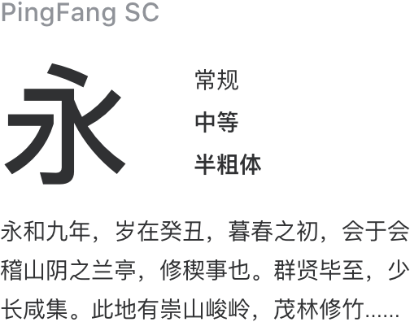
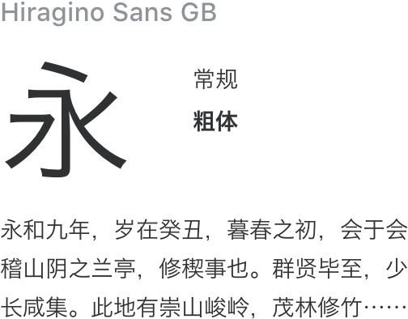
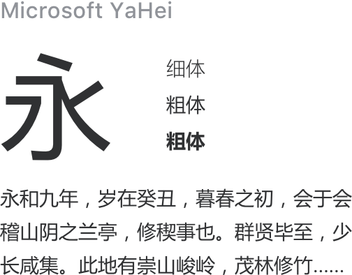
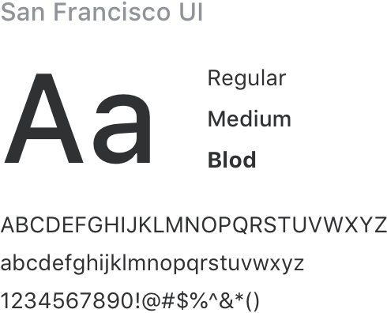
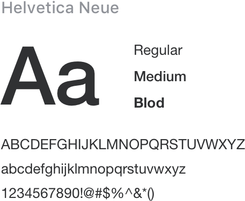
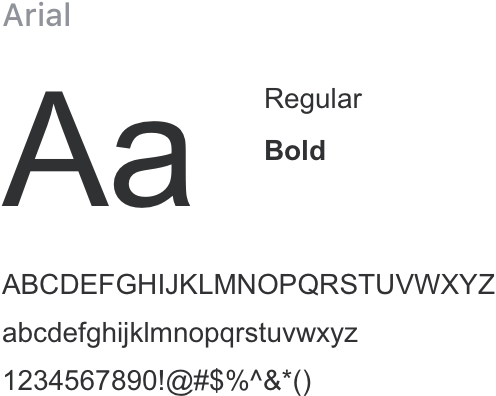

## Typographie

Nous avons créé une convention de police d'écriture afin d'assurer la meilleur présentation possible sur toutes le plateformes.

### Police

<div class="demo-term-box">






</div>

### Convention des polices

<typography-doc-preview />

### Font Line Height

<div>

<ul class="lineH-right">
<li>line-height:1 <span>No line height</span></li>
<li>line-height:1.3 <span>Compact</span></li>
<li>line-height:1.5 <span>Regular</span></li>
<li>line-height:1.7 <span>Loose</span></li>
</ul>
</div>

### Font-family

```css
font-family:
  'Helvetica Neue', Helvetica, 'PingFang SC', 'Hiragino Sans GB', 'Microsoft YaHei', '微软雅黑', Arial, sans-serif;
```
